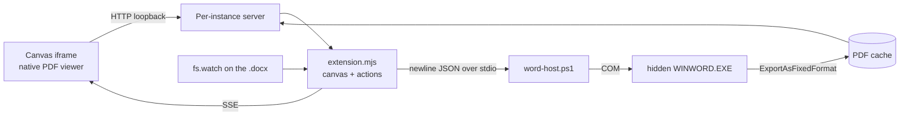

# copilot-canvas

GitHub Copilot canvas extensions that display Microsoft Office documents in the app's side
panel with **page-accurate rendering** — what the Office application would actually print,
not a reflowed approximation.

One extension, `office-canvas`, registers a canvas per application. Word ships today;
PowerPoint is next. Excel is deliberately deferred, because a PDF cannot show a formula and a
formula is exactly what an agent needs to see
([ADR 0003](docs/adr/0003-one-extension-many-canvases.md)).

See [`CONTEXT.md`](CONTEXT.md) for the vocabulary and [`docs/adr/`](docs/adr/) for the
decisions behind the design.

---

# The Word canvas

## What it does

Open a `.docx` next to the conversation and read it while the agent works on it. The agent
can navigate it, search it, and pull text out of it — and when a script regenerates the file,
the canvas re-renders it by itself.

- **Page-accurate.** Word itself lays the document out, so pagination, fonts, headers,
  tables, footnotes and figures are exactly right.
- **Read-only.** Word never opens your file; it opens an unblocked temp copy. Your original
  is never locked and never modified.
- **Live.** The document is watched on disk. Regenerate it from a script and the canvas
  reloads on its own, restoring the page you were on.
- **Navigable.** Heading outline and full-document search in the sidebar; both jump the view
  to the right page.
- **Agent-readable.** `get_text` and `search` give the agent the real document content
  rather than a guess.

## Requirements

- Windows
- Microsoft Word installed (tested with Word 16.0, including a non-English UI)

Word is used purely as a rendering engine: an automation instance runs hidden, and the
extension never touches a Word window you opened yourself.

## Install

The extension lives in `.github/extensions/office-canvas/`, so cloning this repository into a
Copilot project is enough — project extensions are discovered automatically. To use it in
every project instead, copy the `office-canvas` folder to `~/.copilot/extensions/`.

## Usage

Ask the agent to open a document:

> Open `docs/specification.docx` in the Word canvas

Or open the canvas with no path and pick a document from the workspace list, the recents
list, or by pasting a path.

### Canvas controls

| Control | What it does |
| --- | --- |
| Outline | Headings with page numbers; click to jump |
| Search | Full-document search with snippets; click a hit to jump |
| Reload | Force a re-render (the canvas normally does this by itself) |
| Open in Word | Opens the original in your own Word — the read/write escape hatch |

### Agent actions

| Action | Input | Returns |
| --- | --- | --- |
| `open_document` | `path` | Document metadata (pages, words, title, author) |
| `go_to_page` | `page` | The page the canvas scrolled to |
| `get_outline` | `limit?` | `{ headings: [{ level, text, page }], count }` |
| `search` | `query`, `limit?`, `matchCase?`, `wholeWord?` | `{ hits: [{ page, snippet }], count }` |
| `get_text` | `fromPage?`, `toPage?` | The document text, optionally page-scoped |
| `refresh` | `force?` | Whether the document changed and was re-rendered |
| `get_info` | — | Metadata about the open document |

Supported formats: `.docx`, `.docm`, `.doc`, `.dotx`, `.rtf`.

## How it works



A single long-lived PowerShell process owns one hidden Word instance and speaks
newline-delimited JSON over stdio. Word exports the document to PDF; a loopback HTTP server
serves that PDF to the panel's built-in PDF viewer, which supplies scrolling, zoom, text
selection and printing for free. Word stays open as a live document model, which is what
makes outline, search and text extraction cheap — and is the path to read/write later.

Renders are cached under `~/.copilot/extensions/office-canvas/artifacts/`, keyed by
`path + mtime + size`, so reopening an unchanged document is instant and an edited one
re-renders exactly once.

### The Word mark

The small Word icon beside the document name comes from the Word installed on **your own
machine**. `GET /api/word-icon` extracts it at runtime from `WINWORD.EXE` and serves it,
memoized for the life of the process; the extension commits and ships **no standalone
Word-mark asset**. On a machine without Word the mark is simply absent — `showWordMark` in
`src/ui/word-mark.mjs` ships the `` hidden and un-hides it only once it has loaded, and
every extraction failure resolves to `null`, so the route answers 404 and the image stays
hidden. Nothing breaks and nothing is reported. That is the designed behaviour, not a
swallowed error.

Why it is obtained this way rather than from a committed file — and the probe that measured
it — is at the top of
[`src/word/word-icon.mjs`](.github/extensions/office-canvas/src/word/word-icon.mjs). Read that
before concluding the script and the endpoint are disproportionate to a 16×16 image. On the
installation recorded in [`spikes/word-icon/FINDINGS.md`](spikes/word-icon/FINDINGS.md) the
extraction returned 32×32, which covers the 16×16 render at 2×; a larger mark would mean
re-evaluating the extraction path, which that probe did not investigate.

### Safety

- Macros are force-disabled (`AutomationSecurity = 3`) before any document is opened.
- Documents are opened read-only, with a dummy password so an encrypted file fails fast
  instead of hanging on a dialog.
- Only a temp copy is ever opened, so the original is never locked, modified, or added to
  Word's recent-files list.
- A Word instance the extension did not create is never hidden, altered, or quit.
- The owned Word PID is recorded in a per-host PID file and reaped on startup, on canvas
  close, and on process exit — a crashed run cannot leave a hidden `WINWORD.EXE` behind.

## Limitations

- **Windows and Word only.** There is no fallback renderer; without Word the canvas reports
  a clear error rather than degrading to an inaccurate rendering.
- **Scroll position is not readable.** The panel's PDF viewer is not scriptable from the
  parent document, so on live reload the canvas restores the last page it *navigated* to,
  not the exact scroll offset.
- **First render costs a few seconds.** Word's PDF engine loads on first use (~4 s);
  later renders are typically well under a second.
- **Your Word settings are never changed.** Creating or editing a document does not
  read or write any of your Word options, on any instance. Text goes in verbatim
  because it is assigned to a range rather than typed, and autocorrect is a typing
  feature — measured with baits taken from this machine's own replacement list, with
  every autocorrect setting switched on. This used to be untrue: five autocorrect
  settings were switched off around each authoring call and switched back afterwards.
  Those settings are per-user and persist, and whichever Word exits cleanly last
  decides the stored value, so that was a best effort against shared state rather
  than a guarantee — measured in
  `spikes/isolation/probes/probe-autocorrect-concurrency.mjs`. The suppression was
  removed rather than hardened, because the same measurements showed it prevented
  nothing on any path this extension uses.
- **A panel orphaned by an extension reload does not recover on its own.** Reloading the
  extension kills the host, and the viewer's HTTP server dies with it; the app rehydrates
  by opening a fresh server on a fresh ephemeral port, but nothing re-navigates the
  existing webview, so it keeps requesting the dead one. Close and reopen the canvas.
  This is deliberate: the only fix reachable from inside the extension is a deterministic
  port per instance, which would have to be squatted out of the OS's own dynamic range
  (measured here as 49152–65535, with blocks inside it already permanently reserved by
  Windows). The real fix is host-app re-navigation. See
  `docs/adr/0008-orphaned-panels-are-not-recovered-here.md`.
- **The panel itself is display only.** You do not type into it. Reading, authoring and
  editing all happen through Copilot, which drives the installed Word via this
  extension's `read_document`, `create_document`, `edit_document` and `revert_document`
  tools; the canvas re-renders afterwards and says what changed.

## Development

```powershell
# Word bridge: COM lifecycle, read-only guarantees, no orphaned processes
node .github/extensions/office-canvas/test/integration/host-smoke.mjs

# Document service: rendering, cache invalidation, typed errors
node .github/extensions/office-canvas/test/integration/cache-smoke.mjs

# Viewer server: HTTP API, PDF byte ranges, SSE, live reload
node .github/extensions/office-canvas/test/integration/server-smoke.mjs
```

Each suite generates its own `.docx` fixture with Word, asserts on real behaviour, and fails
if a `WINWORD.EXE` is left behind.

| File | Responsibility |
| --- | --- |
| `extension.mjs` | Canvas declaration, actions, lifecycle |
| `copilot-extension.json` | Manifest. `version` is the **manifest format version** and must be the number `1` — `install_extension` parses it as a u32. The product version lives in `productVersion`. |
| `src/word/word-host.ps1` | The Word COM host — every automation quirk lives here |
| `src/word/word-host.mjs` | Node side of the bridge: framing, restart, teardown |
| `src/render-cache.mjs` | Temp copy, PDF export, cache keyed by path + mtime + size |
| `src/server.mjs` | Per-instance loopback server: UI, `/pdf`, `/api/*`, SSE |
| `src/watcher.mjs` | Change detection with settle-polling for multi-step writers |
| `src/store.mjs` | Recents, under the user's Copilot home |
| `src/ui/` | The viewer front-end |
| `test/integration/` | Needs Word installed |
| `test/unit/` | Office-free; the suites CI runs |

Application-specific code lives under `src/<app>/`; everything above it is
application-agnostic. `render-cache.mjs` still imports `word/word-host.mjs` directly, and
that import is the seam PowerPoint will have to break — deliberately left visible rather than
abstracted away before there is a second implementation to abstract over.

The Office-free unit tests are what CI runs:
[`.github/workflows/validate.yml`](.github/workflows/validate.yml) expands
`test/unit/*.test.mjs` and hands the files to `node --test` on `ubuntu-latest`, for pushes to
`main` and for every pull request. The integration suites drive Word through `powershell.exe`
and need an installed, licensed Word, so they are a local gate by necessity, not by neglect.

The `spikes/` directory sits at the repository root rather than inside the extension, because
`install_extension` copies an extension folder wholesale and the spike carries 300 KB of
screenshots that no install needs.

[`spikes/live-word/FINDINGS.md`](spikes/live-word/FINDINGS.md) records why the PDF renderer
was chosen over pixel-streaming a live Word window, with measurements. Short version:
streaming is fast enough (29 fps) and accurate, but it needs a *visible* Word window and gives
up native text selection, search and print — a bad trade for a read-only viewer.

When editing the extension, run `extensions_reload` before testing — and never `console.log`
from `extension.mjs`, since stdout carries JSON-RPC. Use `session.log` instead.

## Licence

This project is licensed under the **MIT Licence** — see [`LICENSE`](LICENSE). SPDX
identifier: `MIT`. That is deliberate: an extension is installed by copying one folder into
someone else's setup and running it alongside their own code, so a licence that reached
through that combination would defeat the delivery mechanism.

### Third-party code

The canvas renders with **Mozilla pdf.js**, vendored into the repository under
`.github/extensions/office-canvas/src/ui/vendor/` and licensed under the **Apache License,
Version 2.0**. It stays under its own terms; MIT covers this project's code, not Mozilla's.
The attribution, the vendored version and a copy of the licence text are in
[`THIRD-PARTY-NOTICES.md`](THIRD-PARTY-NOTICES.md).

### Microsoft Word is yours, not ours

The document tools drive an installation of Microsoft Word that is already on your machine.
No Microsoft code is redistributed here, and Word is not a dependency this project can
supply.

Using those tools therefore requires **your own licensed copy of Microsoft Word**, governed
by your agreement with Microsoft. That is a Microsoft EULA matter and **not** a term of this
project's open-source licence — MIT can neither grant you Word nor take it away, and reading
it as though it could would be a false claim in both directions.
