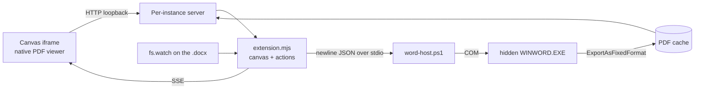

# copilot-canvas-word

A GitHub Copilot canvas extension that displays Microsoft Word documents in the app's side
panel with **page-accurate rendering** — what Word would actually print, not a reflowed
approximation.

## What it does

Open a `.docx` next to the conversation and read it while the agent works on it. The agent
can navigate it, search it, and pull text out of it — and when a script regenerates the file,
the canvas re-renders it by itself.

- **Page-accurate.** Word itself lays the document out, so pagination, fonts, headers,
  tables, footnotes and figures are exactly right.
- **Read-only.** Word never opens your file; it opens an unblocked temp copy. Your original
  is never locked and never modified.
- **Live.** The document is watched on disk. Regenerate it from a script and the canvas
  reloads on its own, restoring the page you were on.
- **Navigable.** Heading outline and full-document search in the sidebar; both jump the view
  to the right page.
- **Agent-readable.** `get_text` and `search` give the agent the real document content
  rather than a guess.

## Requirements

- Windows
- Microsoft Word installed (tested with Word 16.0, including a non-English UI)

Word is used purely as a rendering engine: an automation instance runs hidden, and the
extension never touches a Word window you opened yourself.

## Install

The extension lives in `.github/extensions/word-canvas/`, so cloning this repository into a
Copilot project is enough — project extensions are discovered automatically. To use it in
every project instead, copy the `word-canvas` folder to `~/.copilot/extensions/`.

## Usage

Ask the agent to open a document:

> Open `docs/specification.docx` in the Word canvas

Or open the canvas with no path and pick a document from the workspace list, the recents
list, or by pasting a path.

### Canvas controls

| Control | What it does |
| --- | --- |
| Outline | Headings with page numbers; click to jump |
| Search | Full-document search with snippets; click a hit to jump |
| Reload | Force a re-render (the canvas normally does this by itself) |
| Open in Word | Opens the original in your own Word — the read/write escape hatch |

### Agent actions

| Action | Input | Returns |
| --- | --- | --- |
| `open_document` | `path` | Document metadata (pages, words, title, author) |
| `go_to_page` | `page` | The page the canvas scrolled to |
| `get_outline` | `limit?` | `{ headings: [{ level, text, page }], count }` |
| `search` | `query`, `limit?`, `matchCase?`, `wholeWord?` | `{ hits: [{ page, snippet }], count }` |
| `get_text` | `fromPage?`, `toPage?` | The document text, optionally page-scoped |
| `refresh` | `force?` | Whether the document changed and was re-rendered |
| `get_info` | — | Metadata about the open document |

Supported formats: `.docx`, `.docm`, `.doc`, `.dotx`, `.rtf`.

## How it works



A single long-lived PowerShell process owns one hidden Word instance and speaks
newline-delimited JSON over stdio. Word exports the document to PDF; a loopback HTTP server
serves that PDF to the panel's built-in PDF viewer, which supplies scrolling, zoom, text
selection and printing for free. Word stays open as a live document model, which is what
makes outline, search and text extraction cheap — and is the path to read/write later.

Renders are cached under `~/.copilot/extensions/word-canvas/artifacts/`, keyed by
`path + mtime + size`, so reopening an unchanged document is instant and an edited one
re-renders exactly once.

### Safety

- Macros are force-disabled (`AutomationSecurity = 3`) before any document is opened.
- Documents are opened read-only, with a dummy password so an encrypted file fails fast
  instead of hanging on a dialog.
- Only a temp copy is ever opened, so the original is never locked, modified, or added to
  Word's recent-files list.
- A Word instance the extension did not create is never hidden, altered, or quit.
- The owned Word PID is recorded in a per-host PID file and reaped on startup, on canvas
  close, and on process exit — a crashed run cannot leave a hidden `WINWORD.EXE` behind.

## Limitations

- **Windows and Word only.** There is no fallback renderer; without Word the canvas reports
  a clear error rather than degrading to an inaccurate rendering.
- **Scroll position is not readable.** The panel's PDF viewer is not scriptable from the
  parent document, so on live reload the canvas restores the last page it *navigated* to,
  not the exact scroll offset.
- **First render costs a few seconds.** Word's PDF engine loads on first use (~4 s);
  later renders are typically well under a second.
- **Read-only.** Editing is deliberately out of scope for v1.

## Development

```powershell
# Word bridge: COM lifecycle, read-only guarantees, no orphaned processes
node .github/extensions/word-canvas/test/host-smoke.mjs

# Document service: rendering, cache invalidation, typed errors
node .github/extensions/word-canvas/test/cache-smoke.mjs

# Viewer server: HTTP API, PDF byte ranges, SSE, live reload
node .github/extensions/word-canvas/test/server-smoke.mjs
```

Each suite generates its own `.docx` fixture with Word, asserts on real behaviour, and fails
if a `WINWORD.EXE` is left behind.

| File | Responsibility |
| --- | --- |
| `extension.mjs` | Canvas declaration, actions, lifecycle |
| `src/word-host.ps1` | The Word COM host — every automation quirk lives here |
| `src/word-host.mjs` | Node side of the bridge: framing, restart, teardown |
| `src/render-cache.mjs` | Temp copy, PDF export, cache keyed by path + mtime + size |
| `src/server.mjs` | Per-instance loopback server: UI, `/pdf`, `/api/*`, SSE |
| `src/watcher.mjs` | Change detection with settle-polling for multi-step writers |
| `src/store.mjs` | Recents, under the user's Copilot home |
| `src/ui/` | The viewer front-end |

When editing the extension, run `extensions_reload` before testing — and never `console.log`
from `extension.mjs`, since stdout carries JSON-RPC. Use `session.log` instead.
