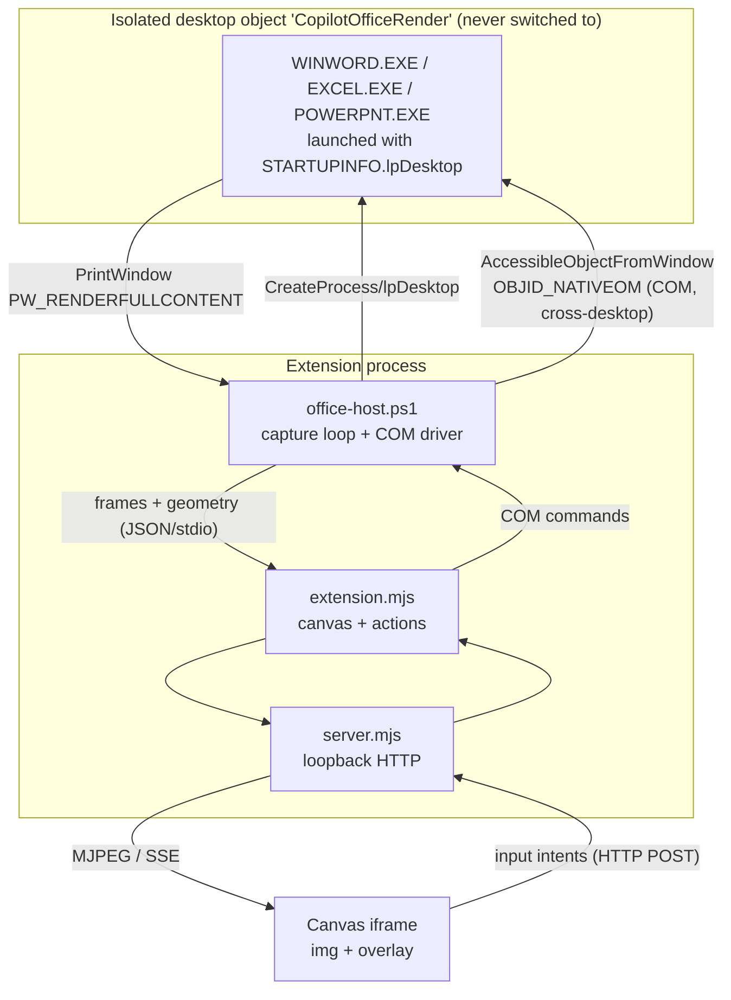

# Live Office Streaming — Build Plan

**Status:** reviewed twice, decided (§14), then **reframed** (§15) — read §15 first.
**Supersedes:** the verdict in `spikes/live-word/FINDINGS.md` ("PDF for v1, streaming is the path to editing")
**Scope:** Word only. Excel and PowerPoint are out of scope until they have their own probes (§14.3).

> **Read §15, then §14.** Sections 1–13 assume the *human* edits through the canvas. That
> assumption is never stated and is wrong: the editor is **Copilot**, and the canvas is a
> display and verification surface. §15 records what that deletes — the coordinate channel, the
> consistency protocol, the typing overlay and probably the pdf.js dependency. Sections 1–10
> are the original streaming proposal, kept for their measurements; §§11–13 are the critiques
> that dismantled it; §14 is the decision. Reading 1–10 as current guidance will mislead you.

---

## 1. Why this plan exists

v1 (shipped, PR #1) renders a `.docx` by driving a hidden Word instance to export a PDF and
letting the canvas' native PDF viewer display it. It is page-accurate and robust, but it is
fundamentally a **snapshot pipeline**: every change costs a full re-export, the viewer's
scroll position is unreadable, and there is no path to editing that doesn't go through
"export again".

The alternative is to stream the pixels of a **live** Word window into the canvas. That was
spiked and rejected, primarily because a live Word window is a real window: it appears in the
taskbar and Alt+Tab, it can steal focus, and the user can click into it.

**The rejection no longer holds.** Direct measurement on this machine shows a Word instance
can be made completely invisible to the user *and still render and capture*, and can be driven
entirely through COM across that isolation boundary. That changes the trade-off enough to
justify rebuilding the renderer.

> **This section's premise was overturned twice.** A third option — keep the static,
> colour-correct, accessible PDF as the *display* path and use the hidden live instance purely
> as an *edit* channel — was measured after this plan was drafted and **wins** (§11). Two
> independent critiques agreed (§12, §13), and re-measurement showed §6 is wrong, §8.1 had no
> control, and §2.1's frame-rate comparison was unnormalised. §14 records the decision:
> single-page re-export costs **168 ms** and is flat in page position, which is what makes
> streaming unnecessary. §4 (isolation) and §5 (COM edit channel) survive; the pixel-capture
> work does not.

---

## 2. What was measured (and what was wrong before)

Everything in this section is a direct observation on this machine (Windows 11, Microsoft 365
Word 16.0 German UI, 125% display scaling), not inference.

### 2.1 The decisive result: a non-input desktop still renders

Create a second **desktop object** with `CreateDesktop`, launch `WINWORD.EXE` with
`STARTUPINFO.lpDesktop` pointing at it, and **never call `SwitchDesktop`**. The window exists
on a desktop that is never shown.

| Observation | Result |
| --- | --- |
| Window found via `EnumDesktopWindows` | `OpusApp visible=True 3072x1240 'desktop-probe.docx - Word'` |
| `PrintWindow(PW_RENDERFULLCONTENT)` from the *default* desktop | `ok=True brightness=41.2 colours=304` — real render |
| Visual inspection of the saved JPEG | Full Word window: ribbon, document text, spell-check squiggles |
| Live re-render proof: change `View.Zoom` 112 → 77 via COM, recapture | New capture shows the new layout — **not a stale frame** |
| Sustained capture rate on that desktop | **61.6 ms/frame** (~16 fps) incl. JPEG encode |
| Same window on the input desktop (spike measurement) | 34.3 ms/frame (~29 fps) — ⚠️ **not comparable to the row above**; different region, dimensions and JPEG settings. Withdrawn, see §12.1 |
| `Documents.Open` via COM across the desktop boundary | **OK in 359 ms**, `Content.Information(4)` → 13 pages |
| `Window.GetPoint` on a **paragraph** range | `x=193 y=529 w=811 h=78` — a valid rectangle, but these are paragraph bounds, **not** a caret. Corrected in §12.2, where a collapsed caret measures `w=0` with per-glyph `x` precision |
| `Window.RangeFromPoint` at 3 different screen points (click-to-caret) | **`start=22`, `255`, `401`** — distinct, correctly ordered document positions |
| Full edit round trip: `RangeFromPoint` → `Select` → `TypeText` → `Undo` | **All OK** |

And the user-visible consequence, measured directly rather than assumed
(`probes/probe-visibility.ps1`):

| Check, run from the default desktop while Word runs on the hidden one | Result |
| --- | --- |
| Windows belonging to that PID on the hidden desktop | 18 (Word is fully there) |
| Windows that `EnumWindows` can see | **0** |
| Alt+Tab candidates (visible, unowned, not `WS_EX_TOOLWINDOW`) | **0** |
| `Shell.Application.Windows().Count` (the shell's own view) | **0** |
| `Process.MainWindowTitle` | **empty** — even .NET cannot find a main window |
| Process alive and holding the document | yes |

A window on a non-input desktop object has **no taskbar button, no Alt+Tab entry, no virtual
desktop presence, and cannot receive user input** — the shell (`explorer.exe`) runs on the
`Default` desktop and only enumerates windows on its own desktop. This is total isolation as
a *side effect of where the window lives*, not as a set of style tricks we have to maintain.

### 2.2 Cross-process `WS_EX_TOOLWINDOW` also works (fallback)

From a non-elevated process, on another process's `OpusApp` HWND: ex-style `0x00000110` →
`0x00000190` (TOOLWINDOW set, APPWINDOW cleared), `IsWindowVisible` still true, capture still
real (`brightness=45.6 colours=194`), and Word still responsive to COM afterwards. The
documented cross-process `SetWindowLong` restriction applies to `GWL_WNDPROC`/`DWL_DLGPROC`
(subclassing), not `GWL_EXSTYLE`.

The change must be bracketed `ShowWindow(SW_HIDE)` → `SetWindowLong` → `ShowWindow(SW_SHOWNOACTIVATE)`,
because taskbar/Alt+Tab membership is only re-evaluated on re-show.

### 2.3 Binding COM to *our* instance, never the user's

`AccessibleObjectFromWindow(hwnd_of__WwG, OBJID_NATIVEOM, IID_IDispatch)` returns the
`Word.Window` of **that specific process**, from which `.Application` gives that process's
object model. Measured: `Documents.Count == 1` (only our document).

This is a significant safety improvement over v1. `New-Object -ComObject Word.Application`
goes through the Running Object Table and may hand back the *user's* Word. The HWND-based
bind cannot: we launched the process, we know its PID, we find its window on our own desktop,
we bind to that. **The user's Word is unreachable by construction.**

### 2.4 Two prior claims that were wrong — and why that matters

1. **`FINDINGS.md` says the dark page was "an artefact of the zoom bug". It is not.** With the
   fit corrected, the page still renders dark (measured `pageBrightness ≈ 58–60`, and visually
   confirmed: dark page, light text). The cause is Office dark mode following the user's
   `UI Theme = 4` (Black). This is a **real fidelity defect of the streaming approach** and is
   tracked as open risk R1 below. `FINDINGS.md` must be corrected.

2. **The isolation research agent confidently asserted both §2.1 and §2.2 were impossible** —
   "kernel-enforced `ERROR_ACCESS_DENIED`", "DWM does not composite non-input desktops, capture
   returns black, do not pursue it" — with citations and a ranked recommendation table. Both
   are false on this machine. The report also warned that COM across desktops would hang on
   DDE paths; `Documents.Open` completed in 359 ms.

   The lesson is a process one and belongs in the plan: **for this problem class, plausible
   secondary sources are not evidence.** Every load-bearing platform claim in this plan must
   be backed by a probe in `spikes/`, and the build phases below are sequenced so that the
   riskiest claims are re-verified first, on more than one machine.

---

## 3. Architecture



**The rule that keeps this honest: pixels flow out, intents flow in.** We never inject
Win32 input. Everything the user does in the canvas is translated into an object-model call.
That is what makes the isolated desktop viable (input can't cross it anyway), what makes
editing safe and undoable, and what generalises to Excel and PowerPoint.

### 3.1 Component layout

```
.github/extensions/word-canvas/          # renamed later to office-canvas
  extension.mjs
  src/
    isolation/
      desktop.ps1          # CreateDesktop, CreateProcess-on-desktop, teardown
      bind.ps1             # AccessibleObjectFromWindow -> app object model
    capture/
      capture.ps1          # PrintWindow loop, crop, encode, dirty-detect
    apps/
      app-word.ps1         # Word adapter: geometry, scroll, hit-test, edit verbs
      app-excel.ps1        # later
      app-ppt.ps1          # later
    office-host.ps1        # command loop; composes the above
    office-host.mjs        # Node bridge (spawn, correlate, restart, reap)
    server.mjs             # loopback: /stream, /api/*, /events
    ui/                    #  + caret/selection overlay + chrome
  spikes/
    live-word/             # existing spike (FINDINGS.md to be corrected)
    isolation/             # the probes from this investigation, promoted
```

The **app adapter** is the generalisation seam. Everything above it — desktop isolation,
capture, transport, overlay, canvas wiring — is app-agnostic. An adapter answers a fixed
question set: *what is the content window; what is the page/sheet/slide geometry; how do I
scroll; how do I map a point to a document position; how do I apply an edit; how do I know
something changed.*

---

## 4. Isolation strategy (ranked, with fallbacks)

| Rank | Strategy | Isolation | Renders? | Evidence |
| --- | --- | --- | --- | --- |
| **1** | Separate **desktop object**, never switched to | Total: no taskbar, no Alt+Tab, no virtual desktop, user input cannot reach it | **Yes**, ~16 fps | §2.1, measured |
| 2 | `WS_EX_TOOLWINDOW` + park off-screen at x=30000 | No taskbar/Alt+Tab; window still on the user's desktop and technically reachable | Yes, ~29 fps | §2.2, measured |
| 3 | Off-screen park only | Taskbar + Alt+Tab still show Word | Yes | measured |
| ✗ | `ShowWindow(SW_HIDE)` or `Application.Visible=false` | Total | **No — pure black** (`brightness=0.0 colours=1`) | measured |
| ✗ | Inactive **virtual** desktop | Total | Expected black (DWM cloaks); **not yet probed** | — |
| ✗ | Session 0 / service | Total | Prohibited by Microsoft policy (KB257757) | policy |

Ship **1 with automatic fallback to 2**. Both are already proven to render; the fallback
matters because rank 1 is the one most likely to behave differently on other hardware,
under RDP, or on a locked workstation (open question Q1).

Note the two mechanisms the user's UAC analogy conflates: the **secure desktop** (a desktop
object, which is what we're using, and which isolates by *location*) and **UIPI/integrity
levels** (which block lower-integrity processes from posting messages to higher-integrity
windows). UIPI is not useful here — it would work *against* us if we needed input injection.
We don't, which is why the desktop-object half of the analogy is the half that pays off.

---

## 5. Read-write design

**Yes, this approach enables read-write** — and it does so more safely than input injection
would. **This is measured, not designed on paper:** on the hidden desktop, `Window.GetPoint`
returned a valid rectangle (a *collapsed* caret measures `w=0` — see §12.2),
`Window.RangeFromPoint` mapped three different screen points
to three correct and correctly-ordered document positions, and a full
`RangeFromPoint → Select → TypeText → Undo` round trip completed successfully (§2.1).

That matters because the documentation warns `RangeFromPoint` needs *screen* coordinates of a
*currently rendered* region, and it was not obvious that a desktop nobody looks at would
satisfy either condition. It does: the hidden desktop has its own coordinate space, the `_WwG`
content window reported a normal rect (`L=7 T=178 R=976 B=1171`), and hit-testing against it
behaves exactly as it would on the visible desktop.

### 5.1 Why not input injection

`SendInput` targets the input desktop and cannot cross to our hidden desktop.
`PostMessage(WM_CHAR/WM_KEYDOWN)` can cross a desktop boundary only in limited ways and is
unreliable against Office's input handling (IME, autocorrect, and ribbon state all assume a
real focus/keyboard state). Injection also makes every keystroke a separate undo record and
gives us no way to know what actually happened.

### 5.2 The intent channel

The canvas captures user interaction and sends **document-level intents**:

| Canvas gesture | Intent | Word object model |
| --- | --- | --- |
| Click in page | `place-caret {x, y, page}` | `Window.RangeFromPoint(x, y)` → `Range.Select()` |
| Drag | `select-range {from, to}` | two `RangeFromPoint` calls → `Document.Range(a,b).Select()` |
| Type | `insert-text {text}` | `Selection.TypeText(text)` |
| Backspace / Delete | `delete {direction, unit}` | `Selection.Delete(unit, count)` |
| Enter | `insert-paragraph` | `Selection.TypeParagraph()` |
| Ctrl+B / I / U | `toggle-format {bold\|italic\|underline}` | `Selection.Font.Bold = -1` etc. |
| Ctrl+Z / Y | `undo` / `redo` | `Document.Undo()` / `Document.Redo()` |
| Scroll | `scroll {delta}` | `Window.SmallScroll` |
| Paste | `paste {text}` | `Selection.TypeText` (plain) — never the shared clipboard |

Coordinate mapping in both directions is available: `Window.RangeFromPoint(x, y)` maps a
screen point to a document position, and `Window.GetPoint(out x, out y, range)` maps a range
back to a screen rectangle. Since we know the window's screen rect and our crop offset, canvas
coordinates convert to window coordinates with a scale factor we already compute for DPI.

### 5.3 Caret and selection are drawn by us

Word's own caret will not blink reliably in a non-focused, non-input-desktop window, and a
captured caret would lag the keystroke by a frame. So the canvas **draws its own caret and
selection highlight** in an overlay, positioned from `Window.GetPoint`. This also makes typing
feel instant: the overlay advances optimistically on keypress, and the next frame confirms it.

Two constraints measured in §12.2 apply here:

- A **collapsed** range yields a true caret (`w=0`, per-glyph `x`), so caret placement is exact.
- A **multi-line** selection yields only a *bounding box*, not the selection's real shape. The
  overlay must therefore walk the selection line by line — one `GetPoint` per line — and draw a
  rectangle list. This is ordinary work, but it is not free and must be budgeted.

### 5.4 Batching and undo granularity

Typed characters are coalesced into `TypeText` calls on a short debounce (~120 ms) so a
sentence is a handful of COM calls, not one per character, and undo granularity stays close to
what a user expects. Every intent is applied to the **temp working copy**, exactly as v1 does;
"save" is an explicit action that copies back to the original path.

### 5.5 What read-write does *not* get us

IME composition, autocorrect-as-you-type, spell-check context menus, drag-and-drop, and
ribbon-driven commands are not reachable through this channel without significant extra work.
The honest framing is **"structured editing"**, not "Word in a panel". The plan targets: text
entry, deletion, selection, basic character/paragraph formatting, undo/redo, and find/replace.

---

## 6. Change notification — SUPERSEDED, this section is wrong

> **Do not implement this section.** Measurement (§12.1) showed the events it relies on either
> do not exist or do not fire in a headless host. The correct design is a polled `doc.Saved`
> dirty flag at 1.14 ms per read. Kept below only to record what was tried.

Capturing at 16–30 fps unconditionally is wasteful for a document that changes rarely. The
pipeline is demand-driven:

1. **Intent-triggered** — any intent we send is followed by a capture.
2. **Event-triggered** — Word's `Application` events (`WindowSelectionChange`,
   `DocumentChange`, `WindowScroll`) fire over COM and can be sinked from the host, which
   requests a frame.
3. **External-change-triggered** — the existing `watcher.mjs` (fs.watch + 300 ms debounce +
   settle polling, already shipped and proven to live-reload a regenerated document) still
   drives reload when a script rewrites the file.
4. **Idle** — no frames at all. A cheap dirty check (capture at low frequency, compare a hash
   of a downsampled frame) guards against missed events without a full-rate loop.

---

## 7. Generalising to Excel and PowerPoint

The isolation, capture, transport and overlay layers are app-agnostic. Each app supplies an
adapter. What differs:

| Concern | Word | Excel | PowerPoint |
| --- | --- | --- | --- |
| Content window class | `_WwG` | `EXCEL7` (child of `XLDESK`) | `mdiClass` / slide pane |
| Unit of navigation | page | sheet + visible range | slide |
| Geometry query | `Window.GetPoint`, `Information(wdActiveEndPageNumber)` | `Range.Left/Top/Width/Height`, `Window.VisibleRange` | `Shape.Left/Top`, `Slide.SlideIndex` |
| Point → position | `RangeFromPoint` | `Window.RangeFromPoint` | `Slide.Shapes.Range` hit-test (weaker) |
| Scroll | `SmallScroll` | `Window.ScrollRow/ScrollColumn` | `View.GotoSlide` |
| Edit verb | `Selection.TypeText` | `Range.Value2 = …` | `TextFrame.TextRange.Text = …` |
| "Page-accurate" means | print layout | **not** a page concept — the grid is the truth | slide canvas, fixed aspect |

Two consequences worth deciding up front:

- **Excel breaks the page metaphor.** The canvas chrome must be per-app, not one generic
  viewer with a page counter. Excel wants a sheet tab bar and a formula bar; PowerPoint wants
  a slide rail.
- **PowerPoint hit-testing is weaker** — there is no true `RangeFromPoint` equivalent for
  arbitrary points, so click-to-place-caret inside a text box needs a shape-bounds walk. Plan
  for PowerPoint editing to be shape-level first, text-level second.

Build order: **Word (read) → Word (write) → Excel (read) → PowerPoint (read) → write for
both.** Excel before PowerPoint because its object model hit-testing is stronger and it will
stress the adapter seam harder (no pages, virtualised grid), which is exactly what we want to
learn early.

---

## 8. Risks and open questions

| # | Risk | Impact | Mitigation / next step |
| --- | --- | --- | --- |
| **R1** | **Dark mode**: the streamed page follows the user's Office theme and renders dark. `ExportAsFixedFormat` (v1) never has this problem. | High — breaks "page-accurate" | Three candidates, in order: (a) find the per-user setting Word 365 uses for dark page and set it for our instance only — it is *not* `Common\UI Theme` (flipping that to 5 at launch did not change the render, measured), so it is likely a roamed cloud setting; (b) run our instance under a separate Windows user profile / isolated registry hive; (c) accept it and post-process the frame (invert luminance on the page region) — ugly and lossy. **Must be resolved before this replaces the PDF renderer.** |
| **R2** | Non-input-desktop rendering may not hold on other machines, under RDP, or when the workstation is locked | Fatal to rank-1 isolation | Partially closed — see the matrix below. **Locked workstation is the one that matters and is still untested.** Automatic fallback to rank 2 regardless |
| **R3** | 61.6 ms/frame on the hidden desktop is ~2× the input-desktop cost | Sluggish typing feel | Try `SetThreadDesktop` onto the hidden desktop before capturing (untried); crop to the content window; encode WebP/JPEG at lower quality; only capture on intent/event |
| **R4** | Empirical `0.92` fit factor in the current zoom maths is unexplained | Mis-scaled pages | Replace with page-rectangle detection: `Window.GetPoint` on a range at the top-left of the page body gives a real anchor; derive scale from that instead of guessing |
| **R5** | Office dialogs (activation, licensing, recovery, "document in use") appearing on a desktop nobody can see | Silent hang | Enumerate the hidden desktop's windows on a timer; any unexpected top-level window is detected, screenshotted into the log, and dismissed or surfaced to the user as an actionable error |
| **R6** | Orphaned `WINWORD.EXE` on a desktop that is never shown is *worse* than v1's orphans — invisible to the user | Resource leak, file locks | Reuse v1's PID-file reaping, plus close the desktop handle on exit; a desktop object is destroyed when its last window closes, which gives a second cleanup signal |
| **R7** | Supportability: Microsoft does not bless Office automation in unusual window/desktop contexts | Long-term fragility | Stay in an interactive user session (we do); never Session 0; keep rank-2 fallback which is an entirely ordinary window |
| **Q1** | ~~Does WGC work on a non-input desktop?~~ **Closed — WGC is unavailable to us regardless.** `GraphicsCaptureSession.IsBorderRequired = false` (the only way to suppress WGC's yellow capture border) requires a declared capability that is **only available to MSIX-packaged apps**. Our host is an unpackaged Node/PowerShell process, so the yellow border would be permanent and drawn around the captured content. `PrintWindow` draws no border. **`PrintWindow` stays.** | — | Revisit only if the host app is ever packaged |
| **Q2** | Does typing latency through the COM intent channel feel acceptable? | Decides whether write mode ships | Prototype gate in phase 4 — measure keypress → confirmed frame |
| **Q3** | `RangeFromPoint`/`GetPoint` need the target to be in the *rendered viewport*. Scrolling before hit-testing adds a COM round trip. | Latency spike on click-after-scroll | Keep a cached map of visible ranges per frame; only `ScrollIntoView` when the target is off-viewport |

### 8.1 Isolation robustness matrix (R2)

The single biggest threat to this plan is that all of §2 was measured on one machine in one
state. Progress so far:

| Variable | Status | Result |
| --- | --- | --- |
| Office **hardware acceleration ON** (the default; no `Graphics` registry key present) | **Tested** | `brightness=41.2 colours=304` — works |
| Office **hardware acceleration OFF** (`DisableHardwareAcceleration=1`) | **Tested** | `brightness=41.2 colours=304` — **identical**, works |
| **Workstation locked** | **Untested — highest priority** | Unknown. Research inference says the message-based render path *should* survive a lock because it does not depend on display output, but this is explicitly unverified and community reports of `PrintWindow` failing on locked workstations concern a different code path. **Must be tested manually; it is the most likely single point of failure in normal use, since users lock their machines constantly.** |
| Second machine / different GPU | Untested | — |
| RDP connected | Untested | Inference: likely works |
| RDP disconnected | Untested | Inference: high risk |
| Display sleep / power save | Untested | Related to the locked case |
| Different Office build / channel | Untested | — |

The acceleration result is the meaningful one so far: it was flagged as *the* critical
variable that could make the whole finding contingent on a user setting, and it turned out to
make no difference at all. That materially raises confidence in the mechanism. The locked-
workstation case replaces it as the top open risk.

---

## 9. Build phases

Each phase ends with a written, measured result. Phases 1–2 are pure de-risking: if they fail
we stop, and v1's PDF renderer remains the shipping renderer.

| Phase | Goal | Exit criterion |
| --- | --- | --- |
| **0. Correct the record** | Fix the wrong dark-page claim in `FINDINGS.md`; promote the four probes from `$TEMP` into `spikes/isolation/` | Findings match measurements; probes are reproducible from the repo |
| **1. Prove isolation holds** | Work the R2 matrix in §8.1: **locked workstation first** (hard gate), then a second machine, RDP connected + disconnected, display sleep | Locked-workstation behaviour known and handled. If a lock kills the render, the canvas must detect it and recover on unlock rather than showing a dead frame — that recovery path is part of the exit criterion, not a follow-up |
| **2. Solve dark mode (R1)** | Make the streamed page render in print colours without touching the user's settings | A capture whose page region is white on a machine with `UI Theme = 4` |
| **2b. Decide streaming vs option C** | Measure single-page `ExportAsFixedFormat` re-export latency (`From`/`To` page args) using v1's existing export path | **DONE — resolved in favour of option C.** 168 ms single-page, 183 ms edit-to-updated-page, flat in page position. See §11. Phases 3+ below describe the streaming build and are superseded unless option C fails |
| **3. Read-only streaming canvas** | Isolated desktop + capture + transport + crop/fit via page-rect detection (R4) + chrome | Side-by-side with the PDF canvas at equal fidelity; scroll stays put across reloads (the thing v1 cannot do) |
| **4. Write mode for Word** | Intent channel, overlay caret/selection, batched `TypeText`, undo/redo, explicit save | Type a paragraph, format it, undo it; measure keypress → frame (Q2) |
| **5. Excel adapter (read)** | Prove the adapter seam by making a second app work without touching the layers above it | Excel renders and scrolls with no changes to capture/transport/overlay |
| **6. PowerPoint adapter (read)** | Third app | As above |
| **7. Write for Excel/PowerPoint** | Cell edits, text-box edits | — |

**Kill criteria.** If phase 1 shows rank-1 isolation is machine-specific *and* rank-2's
taskbar suppression proves unreliable, or if phase 2 cannot solve dark mode without mutating
the user's Office configuration, streaming does not replace the PDF renderer. It could still
ship as an opt-in second canvas for editing, with PDF remaining the default viewer.

---

## 10. Relationship to the shipped v1

v1 stays. It is the fallback renderer when Office is an older build, when isolation fails, or
when the user prefers it — and it is the only renderer that gives free text selection, native
Ctrl+F and print. The streaming canvas is additive, and the two share the document lifecycle,
temp-copy safety, macro disabling, watcher, and process reaping that v1 already proved out.

---

## 11. The third option: static render + live edit channel (option C)

The plan above frames this as a binary — snapshot PDF (v1) versus pixel streaming. It is not.
The two capabilities that motivate streaming are **liveness** and **editing**, and only one of
them actually requires streaming pixels.

**Option C:** keep `ExportAsFixedFormat` → PDF as the *display* path, and use the hidden,
isolated live Word instance purely as the *edit and query* channel. Edits arrive as intents
over COM exactly as in §5; after an edit settles, re-export and refresh the PDF.

### What option C keeps that streaming throws away

| Property | Streaming | Option C |
| --- | --- | --- |
| Page colour correct under a dark Office theme | ✗ (risk R1, unsolved) | ✓ — `ExportAsFixedFormat` always emits print colours |
| Text selection and copy | ✗ — a bitmap has no text | ✓ native |
| Ctrl+F within the page | ✗ must be reimplemented via COM `Find` | ✓ native |
| Print | ✗ | ✓ native |
| Page thumbnails, zoom controls | ✗ must be rebuilt | ✓ native |
| **Screen-reader accessibility** | ✗ — an opaque bitmap | ✓ — tagged PDF text |
| Depends on non-input-desktop rendering (R2) | ✓ **fatal dependency** | ✗ — only needs COM, which is far better supported |
| Depends on capture frame rate (R3) | ✓ | ✗ |
| Depends on the 0.92 fit fudge (R4) | ✓ | ✗ |
| Editing via COM intents | ✓ | ✓ — **identical mechanism** |
| Live external-change reload | ✓ | ✓ — `watcher.mjs`, already shipped |
| Scroll position preserved across updates | ✓ inherently | ~ needs work: re-anchor the viewer after refresh |
| Update latency after an edit | ~35–60 ms | re-export cost |

The striking row is the dependency block. Option C **deletes risks R1, R2, R3 and R4 outright**
— including the two the plan itself calls the biggest threats — while keeping the editing
capability that was the entire reason to move away from v1. Everything measured in §2.1 about
COM working across the desktop boundary (`Documents.Open` in 359 ms, `RangeFromPoint`,
`GetPoint`, `TypeText`, `Undo`) applies unchanged to option C, because those are COM facts, not
rendering facts. Only the `PrintWindow` results become irrelevant.

### What option C costs

1. **Re-export latency after each edit.** This is the crux. v1 measured a full 13-page export
   at roughly 1–2 s, which is far too slow to sit between a keystroke and its echo.
   Mitigations, in order of promise:
   - `ExportAsFixedFormat` takes `From`/`To` page arguments, so re-export **only the edited
     page**, not the document. Needs measuring; likely an order of magnitude cheaper.
   - Echo typing **optimistically in the overlay** (§5.3 already draws its own caret and
     selection). The user sees their character immediately in the overlay layer; the
     re-exported page lands underneath a moment later. This is the same trick that makes
     streaming feel fast, applied to a static backing image.
   - Debounce the re-export to end-of-word or end-of-sentence rather than per keystroke.
2. **Scroll and zoom state across refresh.** Reloading the PDF resets the viewer. Needs an
   anchor-and-restore step (page number + offset), which streaming gets for free.
3. **It is not "Word in a panel".** Neither is streaming, given §5.5, so this is a smaller
   difference than it first appears.

### Honest assessment

**Phase 2b has now been measured** (`probes/probe-export.ps1`, 13-page document, this machine):

| Operation | Time |
| --- | --- |
| First export in a fresh Word process (one-off PDF-engine load) | 4547 ms |
| Full 13-page export | 664 ms |
| **Single page export, page 1** | **168 ms** |
| **Single page export, page 7** | **172 ms** — flat, does not scale with page position |
| **Edit + single-page re-export, end to end** | **183 ms mean, 168 ms min** |

Single-page re-export is roughly **4× cheaper than a full export and independent of where the
page sits in the document**, which is the property that matters: editing page 200 of a 300-page
document costs the same as editing page 1.

183 ms is comfortably inside what an optimistic overlay hides. The overlay draws the typed
character immediately (§5.3 already requires that machinery for streaming too), and the
re-exported page lands underneath within a fifth of a second. For comparison, streaming
updates in 61.6 ms — about 3× faster per update, but streaming must pay that cost on *every*
frame, whereas option C pays it only at debounce boundaries.

**The gate therefore resolves in favour of option C.** The plan's phases 3 onward should be
rewritten around static page rendering plus a COM edit channel, which:

- deletes risks **R1 (dark page), R2 (non-input-desktop rendering), R3 (frame rate) and
  R4 (the 0.92 fit fudge)** entirely;
- keeps every measured editing capability from §2.1, all of which are COM facts;
- preserves text selection, Ctrl+F, print, and **screen-reader accessibility**, none of which
  a bitmap can offer;
- reuses `render-cache.mjs` and `watcher.mjs` from the shipped v1 rather than replacing them.

What survives from the streaming research is the part that was actually load-bearing: the
**hidden-desktop isolation** (§4) and the **COM intent channel** (§5). Those are exactly what
option C needs. The pixel-capture work becomes a fallback for the one case option C cannot
serve — showing a live view of the user's *own* Word session — which is not a v2 requirement.

The remaining open risk for option C is **scroll and zoom restoration** across a PDF refresh
(§11 cost 2), which is ordinary engineering rather than a platform unknown.

### The one thing option C changes about the viewer

There is a tension in option C that has to be stated plainly, because it contradicts a v1
finding.

v1 concluded "no pdf.js needs to be vendored" — the canvas iframe renders PDF natively, giving
pagination, scroll, zoom, selection, Ctrl+F and print for free. That is correct **for read-only
display** and option C keeps it there.

It does not survive contact with editing. An edit mode needs three things the native PDF
viewer will not provide to the parent document:

1. the current scroll position, so a refresh can be restored rather than reset;
2. page geometry in client coordinates, so a click can be mapped to a document position via
   `RangeFromPoint` (§5.2);
3. the ability to replace **one** page in place without reloading the document and losing the
   viewer's state.

So option C splits the viewer in two:

| Mode | Renderer | Rationale |
| --- | --- | --- |
| Read-only display (v1 behaviour, unchanged) | native PDF viewer in an `<iframe>` | zero dependencies, everything free |
| Edit mode | **pdf.js**, canvas + text layer | we own scroll, geometry and per-page re-render |

pdf.js is the right choice rather than page bitmaps because it keeps a **text layer**, so
selection, in-page search and screen-reader accessibility survive into edit mode — which was
option C's main advantage over streaming in the first place. Rendering pages as plain images
would throw that away and land us back at streaming's weaknesses with none of its liveness.

**This is the one new dependency option C introduces**, and it should be treated as a real cost
in the phase plan: vendoring pdf.js, wiring its text layer to our overlay, and keeping the two
viewer modes from diverging. It is still a much smaller and better-understood cost than the
four platform risks option C removes.

---

## 12. Independent critique, and what measurement said about it

A rubber-duck critic reviewed §1–§10 (before §11 existed). Its headline verdict — *keep PDF as
the canonical read renderer, use a live hidden Word instance only as an edit channel* — is
**the same conclusion as option C**, reached independently. That convergence is the strongest
signal in this document.

Every disputed factual claim below was then re-measured rather than argued.

### 12.1 Confirmed by measurement — the plan was wrong

**Word has no content-change event.** (`probes/probe-events.ps1`)

| Event | Result |
| --- | --- |
| `WindowScroll` | **does not exist** |
| `DocumentChanged`, `ContentChange` | **do not exist** |
| `DocumentChange` | exists, but did **not** fire on a content edit |
| `WindowSelectionChange` | subscribed cleanly, did **not** fire on a programmatic edit or selection change |

§6's event-driven design was wrong. Note the honest caveat: a PowerShell host does not pump
window messages, so the two "did not fire" rows may reflect delivery rather than semantics.
**That distinction does not matter** — a headless host cannot depend on these either way.

**The replacement is a cheap polled dirty flag**, which measurement shows is entirely viable:

| Poll candidate | Cost per read | Verdict |
| --- | --- | --- |
| `doc.Saved` | **1.14 ms** | ✓ flips `True`→`False` on any edit, resettable, use this |
| `window.VerticalPercentScrolled` | 3.13 ms | ✓ cheap enough for scroll tracking |
| `doc.Content.Information(4)` (page count) | **36.5 ms** | ✗ far too expensive to poll; only after a settle |

At 10 Hz, `doc.Saved` costs about 1% of one core. §6 should be rewritten around this.

**Other critique findings accepted without further test**, because they are design gaps rather
than platform questions: no version/consistency protocol between pixels, geometry and intents
(a click on frame N must not edit state N+1); no revision-ownership or conflict policy for
write mode, where v1's "reopen from the original on crash" becomes a **data-loss path**; hidden
modal dialogs can deadlock the COM thread, so a separate watchdog and a kill-on-close **Job
Object** must replace PID-file cleanup; multi-document concurrency is undefined; the frame-rate
comparison in §2.1 (16 fps vs 29 fps) is **invalid** because the two measurements used
different regions, dimensions and JPEG settings, and is withdrawn.

### 12.2 Partly refuted by measurement

The critique said `probe-hittest.ps1` proved nothing about caret geometry because its `GetPoint`
call returned an 811×78 rectangle — a paragraph, not a caret. **It was right about my probe and
right that I reported it carelessly.** But the capability does exist; the earlier probe simply
measured the wrong thing. (`probes/probe-caret.ps1`)

| Range | `GetPoint` result | Reading |
| --- | --- | --- |
| collapsed at 120 | `x=4356 y=625 w=0 h=46` — **zero width** | a true zero-width caret |
| collapsed at 121 | `x=4367 y=625 w=0 h=46` | **11 px apart — per-glyph precision** |
| span 120–140 (one line) | `x=4356 w=213 h=46` | correct single-line extent |
| span 120–400 (multi-line) | `x=4224 w=811 h=235` | **a bounding box — critique correct** |

And the round trip is exact: caret at offset 120 → screen point → `RangeFromPoint` → **offset
120, zero characters of error**.

So: collapsed-caret placement and click-to-position are sound and precise. **Multiline
selection genuinely cannot be expressed as one rectangle** — the overlay must build a
per-line rectangle list, which is ordinary work but must be designed rather than assumed.

An API-shape correction worth recording: **`GetPoint` is a method of `Window`, not `Range`.**
Calling it on a `Range` fails with `DISP_E_UNKNOWNNAME`.

### 12.3 Where the critique and option C differ

The critique proposes streaming during an edit session. §11 measured single-page re-export at
**168 ms, flat in page position**, which the critique did not have. That number makes
streaming unnecessary even for editing: an optimistic overlay plus a 168 ms page refresh
delivers editing without inheriting the dark-page, non-input-desktop, frame-rate and page-fit
risks. Option C is therefore the stronger form of the critique's own recommendation.

### 12.4 Consequences for the plan

1. §6 (change notification) — **rewrite** around polled `doc.Saved`, not events.
2. §2.1 — **withdraw** the frame-rate comparison; **correct** the caret claim.
3. Add a **version/consistency protocol** to §5 before any coordinate intent is implemented.
4. Add a **revision-ownership and conflict policy** before any write path is implemented.
5. Replace PID-file cleanup with a **Job Object**; add a **dialog watchdog** in a separate process.
6. Scope the first build to **Word only**; treat Excel and PowerPoint as separate products
   pending their own geometry probes (§7's adapter seam is thinner than claimed).
7. Build a **disposable typing/caret/selection prototype before** the production renderer, so
   the editing feel is judged before anything durable is built on it.

---

## 13. Second critique - the one that ran its own probes

A second reviewer re-ran four independent probes on this machine rather than reasoning from
the write-up. It reached the same destination as section 11 (build the third option) **and**
**falsified two claims this document was making**. Its own summary:

> The plan is technically more feasible than its critics claimed and less valuable than its
> author believes.

### 13.1 Claims of mine that were wrong

**The hardware-acceleration result had no positive control.** Section 8.1 reported identical
readings with acceleration ON and OFF (rightness=41.2 colours=304) and concluded the
concern was closed. Identical *to one decimal place and to the exact distinct-colour count*
is not corroboration - it is the signature of a setting Word never consumed. Nothing verified
that DisableHardwareAcceleration took effect. **Section 8.1's conclusion is withdrawn.** It
is the weakest evidence in this document, not the strongest.

**R3 - the frame-rate penalty - does not exist.** I compared 61.6 ms (hidden desktop, `_WwG`
at 900x1200) against the spike's 34.3 ms (input desktop, 560x950) without normalising for
area. Same-harness measurements on the hidden desktop:

| Capture target | Mean |
| --- | --- |
| 529x726 | **24.0 ms/frame** |
| 900x1200 | **36.1 ms/frame** |

Interpolated to 560x950, the hidden desktop lands near 26 ms against the spike's 29.2 ms on
the input desktop. **There is no measurable non-input-desktop penalty. R3 and its entire
mitigation list should be deleted.**

That is the third instance in this project of a number being read without normalising a
variable - after the acceleration control and the theme timing below. Section 2.4 diagnosed
this codebase as over-trusting confident conclusions. It had not yet applied that to its own
arithmetic.

**My dark-mode test was contaminated.** `probe-bench.ps1` set `UI Theme = 5`, then restored
it 3 s after `CreateProcess` - while the window was still 8 s from existing. Word had almost
certainly not read it. Re-tested holding the value across the *entire* startup: the page is
still dark, `brightness=49.0 colours=92`. A registry sweep found no other local dark-page
value. The conclusion survives, but not because of my measurement. Both probes are now
annotated in place.

### 13.2 The mechanism behind the decisive result, and why it is fragile

`PrintWindow` was tested flag by flag on the hidden desktop, on the top-level `OpusApp`:

| Flag | Result |
| --- | --- |
| `0` (plain `WM_PRINT`) | `brightness=0.0 colours=1` - **pure black** |
| `1` (`PW_CLIENTONLY`) | `brightness=0.0 colours=1` - **pure black** |
| `2` (`PW_RENDERFULLCONTENT`) | `brightness=48.1 colours=268` - real render |

Capture works **only** through the DWM-backed path. The research agent's *premise* - that
this depends on DWM compositing - was therefore correct; only its conclusion was wrong.
Section 2.4 recorded the lesson as "plausible secondary sources are not evidence". The
sharper and less comfortable lesson is:

> We depend on DWM compositing a desktop object that is never displayed. That is undocumented
> behaviour, not a contract, and there is no fallback if it stops.

This turns R2 from "might not generalise" into a named mechanism with predictions. DWM
discards or parks redirection surfaces at exactly: workstation lock, session disconnect, RDP
transitions, display sleep, GPU driver reset (TDR), and display hot-unplug. The top untested
row in section 8.1 - locked workstation - is the single most DWM-sensitive case. That is not
a coincidence; it is the mechanism pointing at where to look.

Consequence: locked workstation, RDP disconnect and sleep/resume must be **hard gates in
phase 1**, not matrix cells. If any fails, rank-1 isolation dies and the fallback is rank 2 -
a genuinely visible window parked at x=30000, which `FINDINGS.md` explicitly refused to ship.

### 13.3 Fidelity is a category error, not a bug

Streaming captures Word's **editing view**. `ExportAsFixedFormat` renders through the
**print pipeline**. These differ permanently and by design, so R1 is not one bug scheduled
for phase 2 - it is the first member of an open-ended class:

- the dark page (R1)
- **spell and grammar squiggles** - visible all over `probes/probe-desktop.jpg`, which
  section 2.1 cites *as proof the render is real*. The same artefact is simultaneously the
  evidence and a fidelity defect
- the **licensing nag**, also inside that same evidence frame
- tracked-change markup, revision bars, the comment margin, text boundaries, formatting
  marks, coauthoring presence, the caret
- whatever Office ships next

Each can be chased forever. v1's immunity is **structural**: print output has no view state.

### 13.4 The typing channel is unreliable

TypeText to changed-frame latency on the hidden desktop, five trials: 100.1 ms, 48.8 ms,
42.5 ms, **no frame change**, **no frame change**. Idle frames were verified stable (two
consecutive captures identical), so this is not hash noise. **40% of typed characters
produced no confirming frame** within ~1.5 s. JPEG encode, HTTP and browser decode sit on
top of that.

That breaks the optimistic overlay in section 5.3 twice over. An overlay that draws text and
advances the caret is re-implementing Word's layout engine - wrapping, kerning,
justification, list renumbering, field updates, repagination - and every disagreement is a
visible snap-back. Worse, **autocorrect is on by default and TypeText triggers it**, so Word
rewrites text under the overlay as a matter of routine, not as an edge case.

Credit where due: **undo granularity holds.** 5 characters via one TypeText = 1 undo step,
and document length restored exactly. Section 5.4 stands.

### 13.5 Findings the plan never considered at all

| | Gap | Severity |
| --- | --- | --- |
| a | **The intent channel is an unauthenticated local write path.** v1 serves pixels; this plan adds POST endpoints carrying edit intents. Any local process — or any browser tab that can reach `127.0.0.1` on the port — could insert text, delete ranges and trigger a save into the user's document. Needs a per-session secret, `Origin`/`Host` validation and loopback binding, decided before phase 4. | MAJOR |
| b | **The R5 watchdog cannot fire.** While Word shows a modal dialog the outstanding COM call blocks, and `PrintWindow` blocks with it. R5 puts the detector on a timer inside the same single-threaded host loop that is already blocked. It must live in a separate thread or process. That is an architecture change, not a detail. | MAJOR |
| c | **EDR and antivirus.** `CreateDesktop` + a hidden GUI app + cross-process capture + COM automation is the classic hidden-desktop technique used by banking trojans. This is about the closest behavioural match to malware one could plausibly build in good faith. Get it in front of security before phase 3, not after a customer's EDR quarantines the extension. | MAJOR |
| d | **Multiple documents.** One desktop, one Word, one `ActiveWindow` — and with no focus on a hidden desktop, `ActiveWindow` is ambiguous. Two `_WwG` children were already observed during probing. Multi-document is undesigned. | MAJOR |
| e | **Word's own state is not ours to own.** Zoom, view mode, ruler, navigation pane, window size all change what is captured. Streaming makes every one of them part of our render contract. | MODERATE |

### 13.6 What the second critique changes, on balance

It cuts both ways, and the two directions must not be averaged into a mush:

- **Streaming is more feasible than section 12 claimed.** R3 is deleted — there is no
  non-input-desktop frame-rate penalty. The isolation mechanism is real and now *understood*
  rather than merely observed.
- **Streaming is less valuable than sections 1–10 claimed.** Fidelity is an open-ended class,
  not a bug list (13.3); the typing channel drops 40% of confirming frames (13.4); and the
  capture path rests on undocumented DWM behaviour with no fallback (13.2).

Feasibility was never the binding constraint. **Value was.** So the extra feasibility does not
move the decision, and the reduced value moves it further toward option C.

---

## 14. Decision, and the plan that follows from it

### 14.1 The decision

**Build option C.** Static per-page render via `ExportAsFixedFormat` as the display path; a
hidden, isolated Word instance as the COM edit-and-query channel. Pixel streaming is not
built, and is not a fallback — it is a different product for a case (mirroring the user's own
live Word session) that is not a v2 requirement.

This is the same conclusion section 11 reached, but **section 11's reasoning is now partly
invalid** and should not be cited as-is:

| Section 11 argument | Status after the probe re-runs |
| --- | --- |
| Streaming pays an R3 frame-rate penalty | **Withdrawn** — no measurable penalty exists |
| Dark page (R1) is unsolved for streaming | Stands, and 13.3 shows it is one of a class |
| Non-input-desktop rendering (R2) is a fatal dependency | Stands, and is now a *named* mechanism: undocumented DWM compositing (13.2) |
| Option C keeps text, Ctrl+F, print, accessibility | Stands — and 13.3 explains *why* structurally: print output has no view state |
| 168 ms single-page re-export makes streaming unnecessary | Stands, and is the strongest number in this document |

### 14.2 The one place option C also takes damage

Section 13.4 is not a streaming-only finding. The **optimistic typing overlay** appears in
option C too (§11 cost 1), and the critique lands on it there as well: an overlay that echoes
characters is re-implementing wrapping, kerning, justification, list renumbering and field
updates — and **autocorrect rewrites text underneath it as routine behaviour**.

The correct response is not to build the overlay better. It is to **not need it**:

> **v2 does free-form typing nowhere.** The canvas offers *structured* edit intents —
> insert/replace a range, apply formatting, accept/reject a revision, add a comment — each of
> which is a single COM call followed by one 168 ms single-page re-export. There is no
> per-keystroke echo, so there is no overlay, so there is nothing for autocorrect to fight.

Free-form in-canvas typing becomes an explicit non-goal for v2, revisited only if structured
editing proves insufficient in practice. This also disposes of the coordinate/version
consistency protocol (§12.4 item 3) for v2: intents are anchored to document ranges, not to
pixel coordinates in a frame that may be stale.

### 14.3 Revised phases

| Phase | Content | Gate |
| --- | --- | --- |
| **0** | Security review of the isolation approach (13.5c) **before** any hidden-desktop code ships. Also settle the intent-channel auth model (13.5a): per-session secret, `Origin`/`Host` checks, loopback-only bind. | Security sign-off |
| **1** | Hidden Word host: `CreateDesktop` + Job Object lifetime (§12.4 item 5) + COM binding to *our* instance (§2.3). No capture code at all. | `Documents.Open` and `ExportAsFixedFormat` succeed on the hidden desktop under **lock, RDP disconnect and sleep/resume** — these are hard gates (13.2), though they now test *COM*, not DWM, so they should pass far more comfortably |
| **2** | Out-of-process dialog watchdog (13.5b) + multi-document model (13.5d). | A modal dialog in Word is detected and surfaced while a COM call is blocked |
| **3** | Single-page re-export pipeline wired to `render-cache.mjs`; page-level invalidation. | Edit → visible page refresh ≤ 250 ms end to end |
| **4** | pdf.js edit-mode viewer (§11.494): scroll anchoring, per-page replace, text layer retained. | Scroll and zoom survive a page refresh |
| **5** | Structured intent set over the authenticated channel. | Undo granularity: one intent = one undo step (already measured, §13.4) |

Excel and PowerPoint remain **out of scope** (§12.4 item 6). Their export geometry is
different enough that §7's adapter seam is thinner than it was written to be, and none of it
has been probed.

### 14.4 What this document is worth

Three of its confident conclusions were falsified by re-measurement: the hardware-acceleration
control, the R3 frame-rate penalty, and the dark-mode timing. Each was falsified by *running
the probe again with one variable normalised* — never by argument. The probes in
`probes/` are therefore the durable artefact here; the prose is a snapshot of what they
supported at the time.

The single most useful output of this whole investigation is a number that took ten minutes to
measure and made a month of streaming work unnecessary: **168 ms**.

---

## 15. The reframing: Copilot is the editor, not the user

Sections 1-14 all assume the **human** edits through the canvas. That assumption is never
stated, because it was never noticed. It is wrong, and correcting it is the largest single
simplification in this document.

**The canvas is a display and verification surface. Copilot drives the edits over COM.**

### 15.1 What this deletes

| Machinery | Why it existed | Status |
| --- | --- | --- |
| `RangeFromPoint` / `GetPoint` coordinate channel (§5.2) | Translate a human's click into a document range | **Deleted** — an agent addresses ranges semantically ("the paragraph under heading X"), never by pixel |
| Version/consistency protocol (§12.4 item 3) | Guard against a click landing on a stale frame | **Deleted** — it existed only to protect the coordinate channel |
| pdf.js edit-mode viewer (§11.494) | (a) scroll position, (b) client-coordinate page geometry, (c) per-page replace | **Retained — see §15.5.** Ground (b) is gone with the coordinate channel, but the reframing creates a stronger ground that (a)–(c) never covered: an agent that edits must be able to *show what it changed*, and nothing can be drawn over the native plugin's content |
| Optimistic typing overlay (§5.3, §11 cost 1) | Hide re-export latency behind a keystroke echo | **Deleted** — see below |
| Caret and selection rendering (§5.3) | A human needs to see where they are | **Deleted** — an agent has no caret |
| The 168 ms latency budget (§11) | Had to fit between a keystroke and its echo | **Non-binding.** Agent edits are transactional; even the 664 ms full export is acceptable. The number is now a nicety, not a gate |
| 40% dropped confirming frames (§13.4) | Broke per-keystroke echo | **Irrelevant** — there is no per-keystroke echo |

Section 14.2 dropped free-form typing as a *concession*. Under this framing it is not a
concession at all: there is no typist. The structured, range-anchored intent set in §14.2 is
simply the natural shape of an agent API.

### 15.2 Why this is the stronger product

The competition is not "Word in a panel". It is **how an agent edits a `.docx` today**:

| | `python-docx` / raw OOXML | Pandoc / template generation | Word over COM |
| --- | --- | --- | --- |
| Layout engine | none — writes XML | generates fresh | **real Word layout** |
| Repagination, field update, TOC regeneration | ✗ | ✗ | ✓ |
| Style resolution, cross-references, section breaks | partial, hand-modelled | ✗ | ✓ |
| Edit an *existing* complex document without degrading it | risky — drops what it doesn't model | ✗ not applicable | ✓ |
| Tracked changes, comments | painful | ✗ | ✓ native |
| **Can the agent see the result?** | **✗ edits blind** | ✗ | **✓ re-export and look** |
| Runs on Linux / CI | ✓ | ✓ | **✗ Windows + Office only** |
| Bulk generation from scratch | fast | fast | **unmeasured, likely slower** |

The decisive row is *can the agent see the result*. Every current option edits blind. This one
closes the loop: **edit → re-export → inspect the page**. The canvas becomes the surface on
which the agent shows its work, which is also why the display path should stay the
print-pipeline PDF (§11) — the thing being verified should look like what prints.

### 15.3 The two honest limits

1. **Windows with Word installed.** `python-docx` runs anywhere. This does not. For a desktop
   Copilot app that is acceptable; for anything server-side it is disqualifying. State it as a
   product boundary, not a caveat.
2. **Authoring long documents from scratch may still belong to `python-docx`.** Thousands of
   COM round-trips are slow where XML writing is not. `Range.InsertXML` is the obvious
   mitigation and is **unmeasured**. Until it is, claim COM wins for *editing existing
   documents* only.

Autocorrect (§13.4) survives the reframing but changes character: it is no longer a visual
snap-back the user watches, it is a correctness issue the agent detects by reading the range
back after writing it. That is a check, not a defect.

### 15.4 Effect on the phases

§14.3 stands, with phase 4 (the pdf.js viewer) **retained and reworded** — see §15.5 — and
phase 5 (structured intents) promoted to the core deliverable rather than the last step.
Phases 0-2 — security review, hidden-desktop host with Job Object lifetime, out-of-process
dialog watchdog — are unaffected: they are about running Word safely and invisibly, which this
reframing needs just as much.

Three probes are now worth more than any further design work:

- `Range.InsertXML` throughput, to settle §15.3 limit 2.
- A read-back-after-write check on `TypeText`, to size the autocorrect problem.
- A screen-reader pass over a pdf.js text layer, to settle §15.5 cost 3.

### 15.5 pdf.js: struck, then reinstated on better grounds

§15.1 first recorded pdf.js as "probably deleted", on the reasoning that two of §11's three
justifications were click-geometry. That was the same error this document keeps catching in
itself: **the dependency was re-checked against the old requirement list.** The reframing did
not only delete requirements, it created one — and that one was never checked for.

**An agent that edits must be able to show what it changed.** Highlight the edited paragraph,
box the inserted table, mark the regenerated TOC. Nothing can be drawn over the content of a
native PDF plugin in an `<iframe>`: its internals are not in our DOM. This is structural, not
difficult. pdf.js renders into a `<canvas>` we own with a text layer we position, so overlays
are trivial.

Agent-editing is therefore the *strongest* argument for pdf.js, not an argument against it.

**v1 already demonstrates the underlying limitation.** From `src/ui/app.js`:

> `// The fragment alone is not enough -- the PDF plugin only reads it while loading -- so the`
> `// src is reassigned.`

Changing page in v1 reloads the whole document. That is the plugin's opacity biting already,
in read-only mode, before any editing exists.

| Capability | Native plugin | pdf.js |
| --- | --- | --- |
| Read scroll position | ✗ | ✓ |
| Change page without a full reload | ✗ — v1 reassigns `src` | ✓ |
| Know which page is visible | ✗ | ✓ |
| Overlay change markers / highlights | ✗ **structurally impossible** | ✓ |
| Swap one re-exported page in place | ✗ | ✓ |
| Custom layout: continuous, side-by-side diff, thumbnails | ✗ | ✓ |
| Identical behaviour across embedders | ✗ varies by browser/Electron build | ✓ deterministic |

The last row is a robustness argument independent of editing: a canvas host without a PDF
plugin cannot display v1 at all. pdf.js removes that dependency on the embedder.

The pairing that matters is **pdf.js + the 168 ms single-page re-export**: edit → re-export one
page → repaint one canvas. No reload, no scroll loss, no flicker. Neither half delivers that
alone.

**It also simplifies rather than complicates.** §11 proposed two viewer modes — native iframe
for read-only, pdf.js for editing — and flagged the risk of the two diverging. Under §15 there
is no user-facing mode switch, because the agent may edit at any moment. So: **one pdf.js
viewer, always.** That is simpler than v1's arrangement and simpler than §11's.

**Costs, stated honestly:**

1. Vendoring pdf.js and its worker (~1–2 MB), which becomes ours to maintain and update.
2. Rebuilding what the plugin gave for free: pagination, zoom, print, search UI, keyboard
   navigation.
3. **Accessibility must be verified, not assumed.** §11 credited option C with tagged-PDF
   screen-reader support *via the native viewer*. pdf.js's text layer gives selectable and
   readable text, but structural tagging — headings, lists, reading order — is weaker. §11's
   parity claim was asserted without test and is **withdrawn pending a probe**.

Consequently §14.3 phase 4 is **not** struck (as §15.4 first said); it stands, reworded: build
the single pdf.js viewer with an overlay layer, per-page repaint, and a verified
accessibility story.

## 16. Measured: what holding the original open actually costs

The proposal under review was that the agent should edit the original file
directly and let Word arbitrate file locking, on the grounds that this is the
cleanest model and avoids a copy the user never asked for. The instinct about
the *user's* mental model is right. The claim about Word arbitrating is not.

### 16.1 Method

`probes/probe-original-lock.ps1` opens a document read-write in a hidden Word
instance and then, while it is held open, attempts the three write patterns a
document generator actually uses. `probes/probe-lock-control.ps1` adds the
control the first probe lacked, running each arm in a job with a hard timeout.

### 16.2 Results

| Test | Result |
| --- | --- |
| Open original read-write | 586 ms, `ReadOnly=False` |
| Lock artefact in user's folder | `~$iginal.docx` appears beside the document |
| External overwrite (`Copy-Item`) | FAILED, sharing violation |
| External write-temp-then-rename | FAILED |
| External exclusive write handle | FAILED, sharing violation |
| Second Word opens a *different* file | opened in 1167 ms |
| Second Word opens *the same* file | **HUNG**, no result in 45 s |

The last two rows are the A/B control. Arm A differs from arm B only in which
path the second instance opens, so the hang is attributable to the lock and not
to running two Word instances.

### 16.3 What this falsifies

**"Word handles the file locking" is false in the way that matters.** Word does
not arbitrate; it *blocks*. The second instance hung indefinitely rather than
failing fast or returning a read-only handle, and it did so with
`DisplayAlerts = 0` already set — so alert suppression does not prevent it. Both
Word processes had to be killed externally. In a hidden instance there is no
dialog for anyone to dismiss, which is the precise failure mode the planned
dialog watchdog exists to catch, arriving through a door the watchdog does not
cover.

**Holding the original open breaks the feature v1 was built around.** All three
external write patterns fail with sharing violations. Auto-refresh on script
regeneration is the behaviour the directory watcher exists to support — the
watcher watches the containing directory precisely because generators replace
and rename. If we hold the original open, the generator's write fails before the
watcher has anything to observe. We would be locking the user out of their own
document while claiming to display it.

A third, smaller cost: `~$iginal.docx` appears in the user's folder for as long
as we hold the document, and it is created and deleted inside the directory the
watcher is watching.

### 16.4 The middle path

None of this argues for a persistent working copy, and the objection to copies
stands: the user should not have to reason about which file is real. What the
measurements argue against is the *duration* of the lock, not its existence.

Hold the original open only for the length of a single operation — open, edit,
save, close — and the lock window shrinks to roughly a second. Between
operations the file is completely free: generators can rewrite it, the user's
Word can open it, and the watcher behaves exactly as it does today. The
document on disk stays the single source of truth, which is what the proposal
was really asking for.

Two things make this affordable rather than merely tolerable. Rendering is
already decoupled — the canvas displays an exported PDF, so nothing needs the
document to stay open to keep the display alive. And per-operation snapshots are
already the agreed undo model, so we were never relying on Word's in-process
undo stack surviving between operations.

The cost is a per-operation open. Measured at 586 ms for the open alone; a full
open-edit-save-close round trip was not cleanly measured because the probe was
interrupted by the arm-B hang, and should be measured before this is committed
to.

### 16.5 Still to resolve

Transient locking shrinks the collision window; it does not eliminate it. If
the user has the document open in their own Word when an operation begins, the
open will still block. That is what the handoff rule is for, and it is now a
requirement rather than a nicety: **an operation must detect that the file is
already open and refuse quickly, rather than blocking**. Detecting it by
attempting to open is exactly what hangs, so detection has to be done another
way — testing for a writable handle, or for the `~$` lock file, before calling
into Word.

## 17. Measured: the transient-lock design is implementable

§16 proposed holding the original open only for the duration of one operation.
That design rests on two things nobody had measured: what a round trip costs,
and whether "already open" can be detected *without* calling `Documents.Open`,
which is the call that hangs.

`probes/probe-transient-lock.ps1`, against a warm hidden instance:

| Measurement | Result |
| --- | --- |
| open + edit + save + close, 5 runs | 236, 232, 233, 219, 219 ms |
| mean round trip | **228 ms** |
| detection, file free | `locked=False` in 9 ms |
| detection, file free, owner-file check | absent |
| detection, file held by another Word | `locked=True` in 4 ms |
| detection, held, owner-file check | present, `~$iginal.docx` |

Two things worth noting. The round trip is **228 ms, not the 586 ms** §16
recorded for a single open — that earlier figure included the one-off cost of a
cold process, and the same effect was already known from the 4547 ms first
export. And the spread across five runs is 17 ms, so this is a stable cost
rather than an average hiding a bad tail.

Detection works and is effectively free. Taking a write handle returns the
correct answer in single-digit milliseconds in both directions, with no false
positive on a free file and no blocking on a held one. That is the property
that matters: the thing that hangs is Word, and this test never involves Word.

### 17.1 The residual race

Detection and open are not atomic. Between the 4 ms check and the open, the
user could open the document in their own Word, and we would be back in the
indefinite hang. The window is small but the consequence is severe — a wedged
hidden instance that only an external kill can clear, as §16 measured.

So detection is a fast-reject path, not a guarantee, and it needs a second
layer behind it: **every `Documents.Open` must be bounded by a timeout**, with
the instance abandoned and killed if it is exceeded. The probe harness already
demonstrates the shape — arm B of the control ran in a job with a hard timeout
and recovered cleanly, where the original probe, which had no timeout, wedged
two Word processes that had to be killed by hand.

The owner-file check adds nothing over the handle test and depends on Word's
odd naming rule (`~$` followed by the basename with its first two characters
dropped). Use it for diagnostics if at all, not for control flow.

## 18. Measured: read-then-address, and the read that nearly sank it

The agreed addressing model is read-then-address: a read returns the document's
structure with IDs minted for that read, plus a revision token; edits cite an ID
and present the token, and are refused if the token no longer matches. Three
assumptions needed testing.

### 18.1 A structural read must be cheap. Naively, it is not.

`probes/probe-addressing.ps1`, walking `Document.Paragraphs` and reading
`Range.Text` and `OutlineLevel` per paragraph:

| Strategy | Time | Structure returned |
| --- | --- | --- |
| **A** Per-paragraph property access | **3724 ms** | text + outline level |
| **B** One `Content.Text`, split locally | **6 ms** | text only, no structure |
| **D** One `Content.WordOpenXML`, parsed outside Word | **289 ms** | text + style + full markup |

219 paragraphs. Strategy A costs roughly 17 ms per paragraph because every
property touch is a cross-process COM call, and the cost scales with document
length — a 1000-paragraph document would take about 17 seconds. That is not a
routine operation, and read-then-address requires reads to be routine.

Strategy D is **13x faster than A and returns strictly more information**: 103 ms
to fetch 106 KB of WordprocessingML, 186 ms to parse it outside Word. The
document is crossed once instead of 438 times. **Structural reads go through
`WordOpenXML`; per-paragraph property walks are a defect.**

Strategy B is worth remembering for the narrow case where only text is wanted —
6 ms — but it carries no structure and so cannot support addressing.

### 18.2 Derived identity works, but this document does not stress it

Word exposes no stable paragraph identity, so IDs must be derived from content.
In `demo.docx`, 219 paragraphs contained exactly **one** empty paragraph and
**zero** duplicate texts, so text alone was already unique and adding a heading
path changed nothing.

That result should not be over-read. It says the scheme is viable, not that a
disambiguator is unnecessary. A document with many empty paragraphs, repeated
table cells, or a boilerplate footer will collide. Keep the key as
**heading path + text + occurrence index**, with the index doing nothing on
documents like this one and earning its place on documents that need it.

The parse also surfaced a localization trap already known from styles: the
first heading's style ID came back as `Überschrift1`, not `Heading1`. Style IDs
inside the markup are localized just as the object model's names are, so the
parser must resolve them via the styles part or fall back to `w:outlineLvl`
rather than matching English names.

### 18.3 The revision token behaves exactly as the model needs

A SHA-256 prefix over the file, computed in **3 ms**:

| Event | Token changed? |
| --- | --- |
| Our own edit and save | yes |
| Save with nothing dirty | no |
| External regeneration of the file | yes |

The middle row matters: Word does not rewrite the bytes when there is nothing
to write, so a token does not churn on inspection. The first row means the edit
response can hand back a fresh token, so the agent is not forced to re-read
after its own edits — only after somebody else's.

That is the whole concurrency story for transient locking. We hold nothing
between operations, so we cannot assume anything stayed put; the token is what
converts that from a hazard into a detectable, refusable condition.

## 19. Measured: "unreadable" is two different conditions, and both runtimes can tell them apart

A code review asked, correctly, whether splitting a single `file_locked` error
into `file_locked` and `permission_denied` claims a precision Windows does not
give us. The concern is the right one — inventing a distinction the platform
cannot make is the same class of error as bounding a timeout with a number
measured on a quiet machine. So it was probed rather than argued.

`probes/probe-errno-mapping.mjs` measures both runtimes the read path crosses,
because `document-reader.mjs` branches on Node's errno and `word-host.ps1`
branches on the .NET exception type. Neither may branch on a *message*: Windows
and Word are German on this machine.

| Cause | Node read handle | PowerShell `Copy-Item` |
| --- | --- | --- |
| `FileShare::None` (exclusive hold) | `EBUSY` | `System.IO.IOException` |
| ACL denying read | `EPERM` | `System.UnauthorizedAccessException` |
| Word's own lock — **write** access granting `FileShare::Read` | succeeds | succeeds |
| Read-only attribute | succeeds | succeeds |
| `chmod 000` | succeeds (ignored on Windows) | — |

Two conclusions, and the second is the more useful one.

**The split is real.** Both runtimes separate a sharing violation from a
permissions denial, cleanly and by type. The two also deserve different
remediation: a lock may clear on its own and is worth retrying, a denied ACL
will not and is not. So the codes are justified.

**Most things that sound like they would block a read do not block a read.** The
read-only attribute does not. `chmod` does not. And decisively, *Word's own lock
does not* — Word holds a handle with **write access** granting
`FileShare::Read`, while both our readers request *read* access and grant
`ReadWrite`. Those requests are compatible, which is why a copy-based read works
at all against a document the user is looking at. This is why `file_locked`
means **"held more strictly than Word holds it"**, not "open in Word". A message
telling a user to close Word would name the one cause that has been measured not
to be the cause.

#### 19.0.1 The correction: right conclusion, wrong mechanism, for months

This table originally recorded that row as `FileShare::Read` (**what Word itself
takes**). That is wrong, and it propagated from here into `CONTEXT.md`, ADR 0006,
`.github/copilot-instructions.md`, `document-reader.mjs`, `word-host.ps1` and the
read smoke test — nine sites — because it was quoted as a measured fact.

It was never measured. `probe-errno-mapping.mjs` **modelled** Word with a holder
granting `Read` and labelled that holder "Word's own lock". The label was an
assumption wearing a measurement's clothes, and every reader in that probe grants
`ReadWrite`, which succeeds against *either* holder. So the probe could not have
detected its own mispremise.

`probe-fileshare-algebra.ps1` separates them. It runs its readers against
synthetic holders and then against a document held by real Word:

| reader asks | `Read`/`Read` | `Write`/`ReadWrite` | **`Write`/`Read`** | **real Word** |
| --- | --- | --- | --- | --- |
| read, grants `ReadWrite` (`Copy-Item`, Node) | ok | ok | ok | **ok** |
| read, grants `Read` — *access discriminator* | ok | violation | violation | **violation** |
| read, grants `None` | violation | violation | violation | **violation** |
| `ReadWrite`, grants `None` (`Test-FileWritable`) | violation | violation | violation | **violation** |
| write, grants `ReadWrite` — *share discriminator* | violation | **ok** | violation | **violation** |

**Word matches the `Write`/`Read` column on every row and matches nothing else.**

#### 19.0.2 The correction was itself half wrong, and in the half it claimed to have measured

The row above ending "**ok**" is the one that took two revisions to reach. The
first correction concluded "write handle granting `ReadWrite`", and recorded
that the *share* half was measured and the *access* half merely inferred. Both
statements are backwards, and adding a fifth, **write-requesting** reader to
`probe-fileshare-algebra.ps1` settled it. (The discriminating reader was devised
first by the `edit_document` session, as a standalone probe on the branch behind
PR #16. It was folded into the algebra probe here so that the evidence for this
claim ships in the same commit as the claim — a probe on another branch is not
something a reader of this one can run.)

**Windows checks two things on every open**, and this is the whole explanation:

- **(a)** the access *you* request, against the share mode of each existing handle;
- **(b)** the access of each existing handle, against the share mode *you* offer.

A reader therefore probes whichever of the holder's two properties its own
request puts on the other side of the comparison, and is **blind to the other**.
Until the share discriminator existed, **every reader in this repo asked for
read access**, so every one of them landed on rule (b): they all measured the
holder's *access* and not one of them could see its *share* mode. The share half
could be asserted in either direction with nothing going red — and was, twice.

The two measurements now force one answer. A write-requesting reader granting
`ReadWrite` cannot fail rule (b), so its violation must be rule (a): Word's share
mode excludes write. A read-requesting reader granting `ReadWrite` succeeds, so
that share mode permits read. `FileShare::Read` is the only value left. And with
read permitted, the refusal of the `read`/`Read` reader can only be rule (b), so
Word's access includes write.

**Word holds write access and grants `FileShare::Read`** — the combination
neither earlier model proposed. Note what that means about the original claim:
it named the correct share value, for a reason that was wrong, and the
correction fixed the access half while breaking the share half.

A caller's `FileShare` value is what it grants to **others**, so a reader asking
for `FileShare::Read` refuses to let anyone else write, conflicting with the
write access Word already holds. **A reader of a possibly-open document must
itself grant `ReadWrite`** — unchanged through all three revisions, and the
reason given for it was correct throughout. `Test-FileWritable` (write access,
granting `None`) now fails *both* checks rather than one, so its refusal is more
firmly guaranteed, not less.

**The most direct disproof was already in this repository, two lines from the
sentence it disproves.** ADR 0005 records that a *write* request fails against a
Word-held document under any share mode — which cannot be true of a
`ReadWrite`-granting holder. It survived several rounds of review in a document
whose subject is that claim. Evidence does not announce itself; a table row and
a prose sentence can contradict each other indefinitely if nobody asks which one
the other predicts.

Three things generalise, and they are why this is written up rather than quietly
corrected:

- **The conclusion was never wrong, so nothing failed.** Reads of open documents
  worked throughout. A wrong mechanism under a right conclusion is invisible to
  every test, which is exactly the shape that survives longest.
- **The wrong mechanism still predicts wrongly**, just not here: it predicts that
  *any* reader of a Word-held file succeeds. Anyone who "hardened" our copy to a
  narrower share mode would have had the documentation on their side while
  breaking every read of an open document.
- **A probe that models the thing under test cannot measure it.** The fix is not
  more care in reading the probe; it is that the discriminating case must be
  identified *before* the probe is trusted — here, the one reader whose result
  differs between the two candidate mechanisms. A probe on which every case
  agrees has measured nothing.

### 19.1 Where the distinction is *not* available, and stays collapsed

`Test-FileWritable` opens a **write** handle, so it collapses sharing violation,
denying ACL and read-only attribute into a single `writable: $false`. That
ambiguity is inherent to the probe, not an oversight, and no code branches on
it: `writable` is reported as a fact alongside a typed code, never used to infer
a cause. The rule the review was reaching for holds — split where the platform
distinguishes, stay collapsed where it does not — and the two halves of this
section are the two sides of it.
